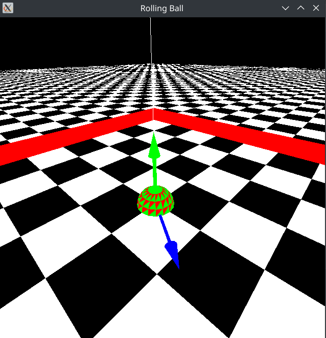
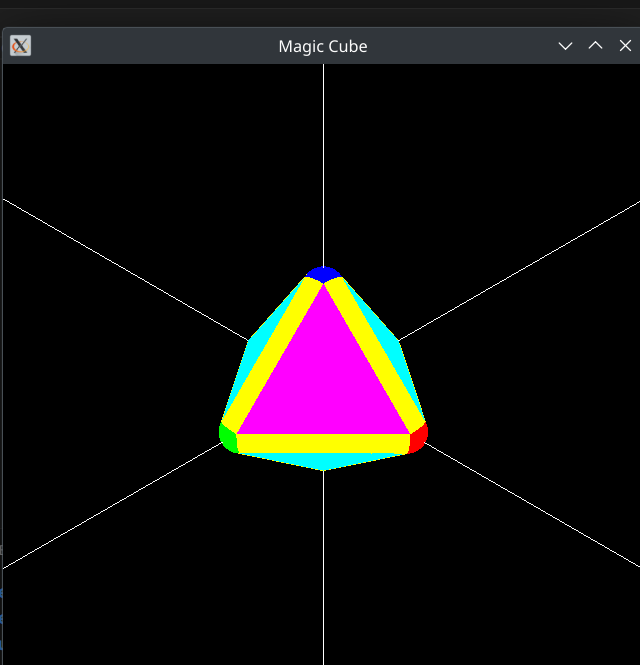
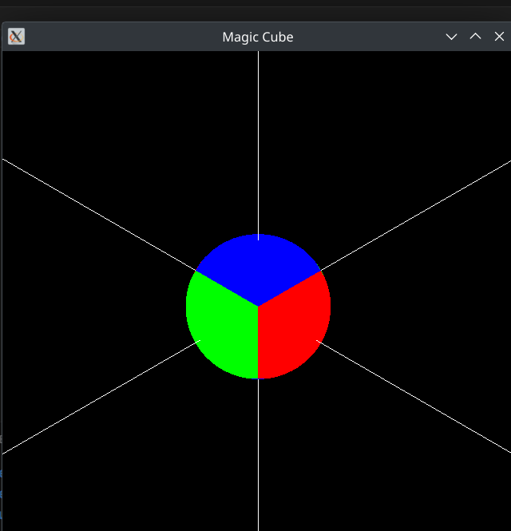
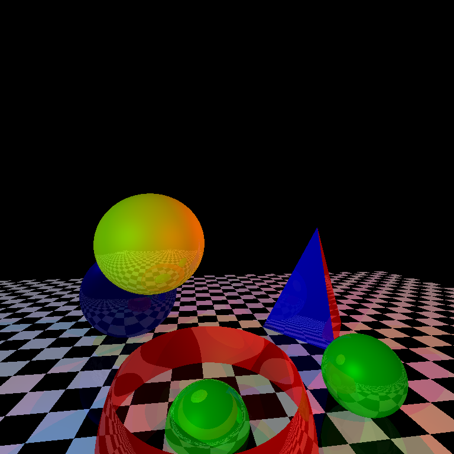

# CSE 410 Computer Graphics Sessional

This repository contains all assignments and related outputs for the **CSE 410 Computer Graphics Sessional** course. Each assignment focuses on different aspects of computer graphics, ranging from OpenGL basics to advanced topics like rasterization and ray tracing.

---

## Assignments

### Offline-1: OpenGL Assignment
- **Description:**
  - Develop OpenGL-based programs to render basic shapes like a ball, cube, and sphere.
- **Outputs:**
   <p align="center">
    
    
    
  </p>


### Offline-2: Rasterization
- **Description:**
  - Implement a rasterization pipeline to render 2D graphics from scratch.
- **Outputs:**
  - 

### Offline-3: Ray Tracing
- **Description:**
  - Build a ray casting + tracing program to render 3D scenes with phong lighting.
- **Outputs:**
  - 


---

## How to Run
## How to Run

### Offline-1
1. Navigate to the folder:
   ```bash
   cd Offline-1
   ```
2. Run the script:
   ```bash
   ./runner.sh
   ```

### Offline-2
1. Navigate to the folder:
   ```bash
   cd Offline-2
   ```
2. Run the script:
   ```bash
   ./runner.sh
   ```

### Offline-3
1. Navigate to the folder:
   ```bash
   cd Offline-3
   ```
2. Run the script:
   ```bash
   ./runner.sh
   ```


---

## Contact

For questions or collaboration, please reach out via email or GitHub.

- **Email:** nafiu.rahman@gmail.com
- **GitHub:** [NafiuRahman77](https://github.com/NafiuRahman77)
